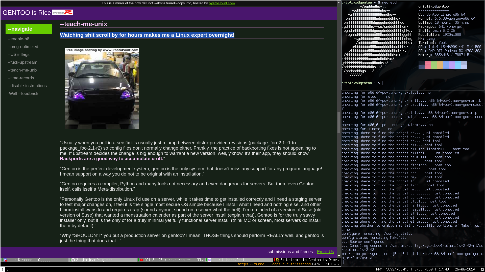

## partitioning 
`cfidsk /dev/sda`

## setup lvm 
`pvcreate /dev/sda2`
`vgcreate vg0 /dev/sda2`
`lvcreate -l 100%FREE -n troot vg0`

## setup luks
`cryptsetup luksFormat --type luks2 --cipher aes-xts-plain64 --key-size 256 --hash sha256 /dev/vg0/cryptroot`
`cryptsetup open /dev/vg0/root root`

## formatting
`mkfs.fat -F32 /dev/sda1`
`mkfs.ext4 /dev/mapper/root`

## mounting
`mount /dev/mapper/root /mnt/gentoo`
`mkdir /mnt/gentoo/boot`
`mount /dev/sda1 /mnt/gentoo/boot`

## installing source files
`cd /mnt/gentoo`
choose systemd stage3 profile `links https://www.gentoo.org/downloads/#other-arches`
`tar xpvf stage3-*.tar.xz --xattrs-include='*.*' --numeric-owner`

## chrooting
`cp --dereference /etc/resolv.conf /mnt/gentoo/etc/`
`arch-chroot /mnt/gentoo`

## installing
`emerge-webrsync`
`eselect profile list`
`echo Africa/Algiers > /etc/timezone`
`emerge --config sys-libs/timezone-data`
`hwclock --systohc`
`nano -w /etc/locale.gen` 
`locale-gen`
`eselect locale list`
`eselect locale set 4`
`env-update`
`source /etc/profile`

`hostnamectl hostname navi`
`systemd-machine-id+set`
`systemd-firstboot --prompt`
`systemctl preset-all --preset-mode=enable-only

## config fstab
`nano /etc/fstab`

```
/dev/mapper/root		/		    ext4		rw		    0 1
/dev/sda1			    /boot		vfat		rw		    0 2
/swapfile			    none 		swap 		sw	        0 0
```
## create the swapfile
...

## configuring portage
`emerge -av dev-vcs/git`
`cd /etc/portage/
`rm -rf make.conf package.use package.env package.accept_keywords package.mask`
`mkdir /etc/porage/env`
`cd`
`git clone https://github.com/criptixo/gentoo-linux-desktop`
`cd gentoo-linux-desktop`
`mv gentoo-linux-desktop/portage/* /etc/portage/`

## needed install software

`emerge -av net-misc/dhcpcd sys-fs/cryptsetup sys-fs/lvm2 app-shells/bash`

## rebuild the system with new portage options this might take a long time
`emerge -e @world`
`emrege --depclean


## install kernel

`emerge -av sys-kernel/gentoo-sources sys-kernel/genkernel`
`eselect kernel list`
`eselect kernel set 1`

`nano -w /etc/genkernel.conf`

enable lvm and luks

genkernel --loglevel=5 all

## bootloader setup
`nano -w /etc/lvm/lvm.conf`
`volume_list = ["vg0"]`

`emerge -av sys-libs/efivar`
`bootctl --path=/boot install`

`import systemd-boot stuff`

## setup a password
`passwd`

## setup a user
`useradd -m -G users,wheel,audio,video -s /bin/bash criptixo`
`passwd criptixo`

## setup doas
`emerge -av app-admin/doas`
`touch /etc/doas.conf`
`chown -c root:root /etc/doas.conf`
`chmod -c 0400 /etc/doas.conf`

`nvim /etc/doas.conf`
`permit :wheel`
`emerge --sync`

## setup autologin
`emerge -av gui-libs/greetd`
...
`systemctl enable greetd.service`

## setup sway env
`emerge -av swaybg foot grim slurp terminus-font`

## steam 
`emerge --ask --noreplace app-eselect/eselect-repository`
`eselect repository enable steam-overlay`
`emerge --sync`
`emerge steam-launcher`

## audio
`emerge -av pipewire libpulse wireplumber pulsemixer`
`systemctl --user enable --now pipewire-pulse.socket wireplumber.service`

## stuff
`emerge -av vulkan-loader neovim playerctl wl-clipboard nicotine+ bemenu ranger zip unzip`
